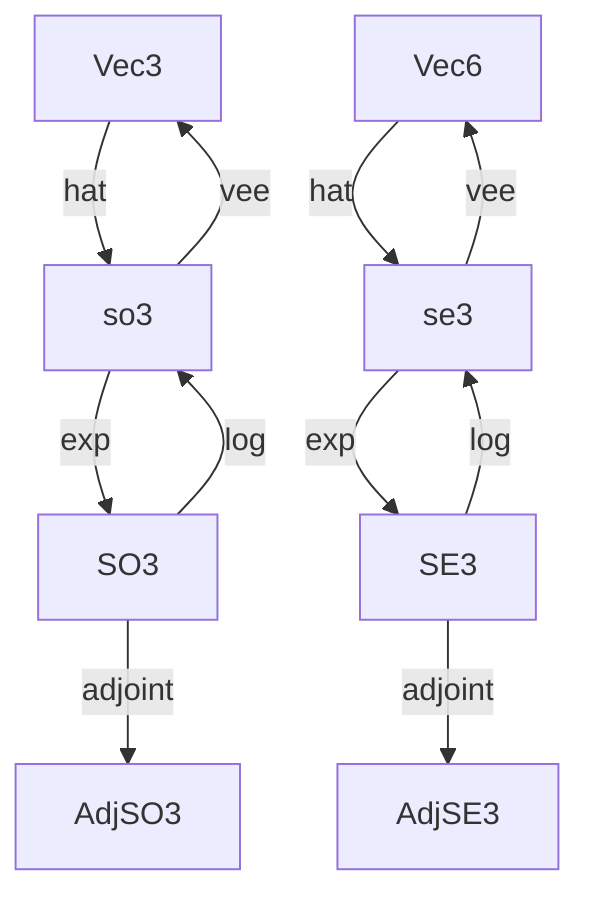

# liealg
## Lie group and Lie algebra in rust

## introduction

*liealg* is a library for computing Lie algebra and Lie group in 3D space(SO3 and SE3).

### domain
*liealg* is mainly used in robot kinematics and other related area. If you want to do some general Lie group and Lie algebra calculations, it is better not to use this library.

## get started

add dependency in your `Cargo.toml`:
```toml
[dependencies]
liealg = "0.1.1"
```
or use `cargo add`:
```bash
cargo add liealg
```

## design
entities in *liealg* are related as follows:


and SO3 and SE3 can multiply matrices, take inverse and 3D point.

## usage
### SO3

```rust
use liealg::prelude::*;

// construct Vec3
let v = Vec3::new(0., 0., 1.) * FRAC_PI_2;

// hat convert Vec3 to so3
let so3 = v.hat();

// exp convert so3 to SO3
let rot = so3.exp();

// SO3 mat_mul
let _ = rot.mat_mul(&other);

// SO3 inverse
let rot_inv = rot.inv();

// SO3 act on 3D point
let point = Point::new(1., 2., 3.);
let _ = rot.act(&point);
```

### SE3
```rust
use liealg::prelude::*;

// construct Vec6
let v = Vec6::new([0., 0., 1], [0., -1., 0.]) * FRAC_PI_2;

// hat convert Vec6 to se3
let se3 = v.hat();

// exp convert se3 to SE3
let t = se3.exp();

// SE3 mat_mul
let _ = t.mat_mul(&other);

// SE3 inverse
let inv = rot.inv();

// SE3 act on 3D point
let point = Point::new(1., 2., 3.);
let _ = rot.act(&point);
```
